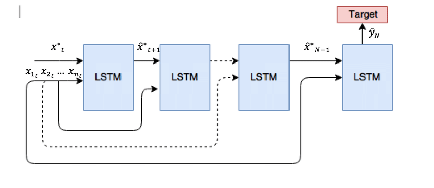
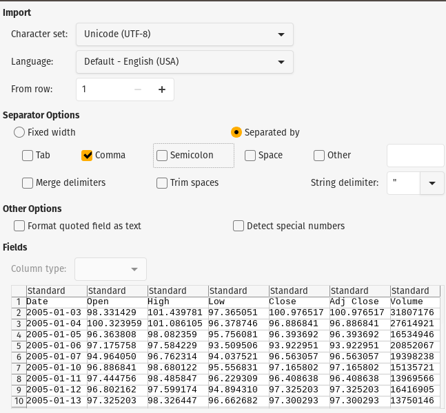
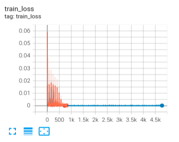
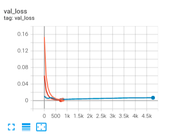

PYTORCH-STOCK-PREDICTION
========================

Fully functional predictive model for the stock market using deep learning Multivariate LSTM Model in Pytorch-Lightning 

LSTM Network

# LSTM Networks
 Long Short Term Memory networks – usually just called “LSTMs” – are a special kind of RNN, capable of learning long-term dependencies. They were introduced by [Hochreiter & Schmidhuber (1997)](), and were refined and popularized by many people in following work.1 They work tremendously well on a large variety of problems, and are now widely used.

LSTMs are explicitly designed to avoid the long-term dependency problem. Remembering information for long periods of time is practically their default behavior, not something they struggle to learn!

All recurrent neural networks have the form of a chain of repeating modules of neural network. In standard RNNs, this repeating module will have a very simple structure, such as a single tanh layer.

    

LSTMs also have this chain like structure, but the repeating module has a different structure. Instead of having a single neural network layer, there are four, interacting in a very special way.

    

In the above diagram, each line carries an entire vector, from the output of one node to the inputs of others. The pink circles represent pointwise operations, like vector addition, while the yellow boxes are learned neural network layers. Lines merging denote concatenation, while a line forking denote its content being copied and the copies going to different locations.

    

# Table of Content

- [Parameters](#config)

- [Dataset](#dataset)

* [Preprocessing](#preprocessing)

* [Model](#model)

<!-- * [Loss function](#lossfunction) -->

<!-- * [Post-processing](#postprocessing) -->

* [Results](#results)

* [Dependency](#dependency)

* [References](#references)

# Config

[`config.json`](config.json) 

    {
        "module.data": {
            "file": "data/processed/GOOG.csv",
            "window": 5,
            "future": 1,
            "targetcolumn": "Close",
            "scaler": "MinMax",
            "batchsize": 32,
            "workers": -1
        },
        "module.model": {
            "hidden": 10,
            "layers": 2,
            "dropout": 0.3
        },
        "module.lightning": {
            "accelerator": "gpu",
            "gpus": 1,
            "epochs": 1000,
            "criterion": "MSELoss",
            "learningrate": 0.002
        },
        "module.tensorboard": {
            "dir": "./reports/",
            "name": "logs"
        },
        "module.earlyStopping": {
            "enable": true,
            "monitor": "val_loss",
            "stopping_threshold": 0.0001,
            "divergence_threshold": 9.0,
            "check_finite": true
        }
    }
# Dataset

[`Pytorch::Dataset`](src/data.py#L13) 

[`Lightning::DataModule`](src/data.py#L48)

    

# Preprocessing

- drop Date and Adj Close column
- [`sklearn::Scaler`](src/data.py#L70)

# Results

    

 Train loss 

    

 Validation loss 

    

 Predictions 

# Dependency

# References

